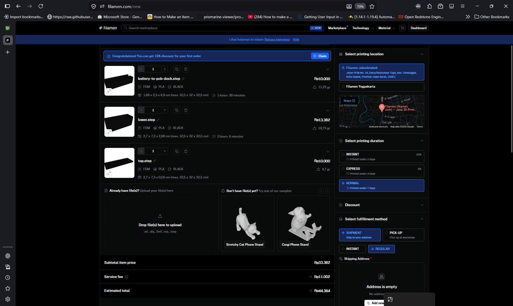
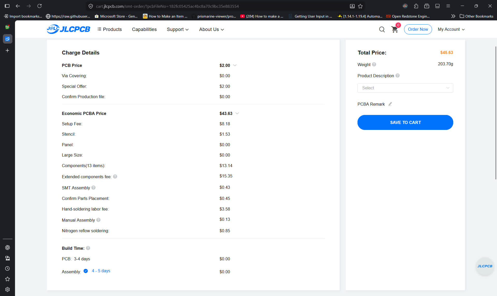

# BOM

## PCBA

| Item                | Quantity | Total Cost         | Order                                                                                                                                             |
| ------------------- | -------- | ------------------ | ------------------------------------------------------------------------------------------------------------------------------------------------- |
| M2x6 Screw          | 4        | Rp5.000 ~$0.28  | https://www.tokopedia.com/archive-lapaktukang/10pcs-baut-hitam-m2-m2x3-m2x4-m2x5-m2x6-m2x7-m2x8-m2x10-1731486102402008940                         |
| 18650 Li-on Battery | 1        | Rp27.500 ~$1.54 | https://www.tokopedia.com/nayfastore/baterai-isi-ulang-baterai-tipe-lithium-ion-18650-butontop-3000mah-3-7v-isi-2-pcs-1731453786169640483         |
| Casing 3D Print     | 1        | Rp44.384 ~$2.49 |                                                                                                                          |
| PCBA                | 1        | $45.63             |                                                                                                                             |
| Wire                | 2        | Rp4.000 ~$0.22  | https://www.tokopedia.com/cncstorebandung/kabel-tunggal-mini-wire-single-core-tinned-cu-permeter-hitam-merah-hijau-kuning-putih-0-6mm-hitam-27149 |
|                     |          |                    |                                                                                                                                                   |
| Total               |          | $48.4              |                                                                                                                                                   |

## Detailed

| Item                            | Quantity | Total Cost         | Order                                                                                                                                             |
| ------------------------------- | -------- | ------------------ | ------------------------------------------------------------------------------------------------------------------------------------------------- |
| M2x6 Screw                      | 4        | Rp5.000 ~$0.28  | https://www.tokopedia.com/archive-lapaktukang/10pcs-baut-hitam-m2-m2x3-m2x4-m2x5-m2x6-m2x7-m2x8-m2x10-1731486102402008940                         |
| 18650 Li-on Battery             | 1        | Rp27.500 ~$1.54 | https://www.tokopedia.com/nayfastore/baterai-isi-ulang-baterai-tipe-lithium-ion-18650-butontop-3000mah-3-7v-isi-2-pcs-1731453786169640483         |
| Casing 3D Print                 | 1        | Rp44.384 ~$2.49 |                                                                                                                          |
| Wire                            | 2        | Rp4.000 ~$0.22  | https://www.tokopedia.com/cncstorebandung/kabel-tunggal-mini-wire-single-core-tinned-cu-permeter-hitam-merah-hijau-kuning-putih-0-6mm-hitam-27149 |
| Resistor 100Ω 0402              | 2        | $0.002             | C25076 (JLCPCB)                                                                                                                                   |
| Capacitor 100nF 0402            | 5        | $0.04              | C307331 (JLCPCB)                                                                                                                                  |
| Resistor 10k 0402               | 1        | $0.015             | C25744 (JLCPCB)                                                                                                                                   |
| Thermistor 10k 3380K 0402       | 1        | $0.008             | C29553871 (JLCPCB)                                                                                                                                |
| Capacitor 2.2uF 0603            | 3        | $0.027             | C23630 (JLCPCB)                                                                                                                                   |
| Inductor 2.2uH SMD 6.0x6.0mm    | 1        | $0.24              | C285900 (JLCPCB)                                                                                                                                  |
| USB C Receptacle 16P            | 1        | $0.065             | C393939 (JLCPCB)                                                                                                                                  |
| Capacitor 22uF 0805             | 7        | $0.665             | C45783 (JLCPCB)                                                                                                                                   |
| LED White 0603                  | 4        | $0.048             | C2290 (JLCPCB)                                                                                                                                    |
| 90deg Tactile Button SKHLLDA010 | 1        | $0.239             | C125032 (JLCPCB)                                                                                                                                  |
| Bluetooth Module E104-BT5005A   | 1        | $3.67              | C2874127 (JLCPCB)                                                                                                                                 |
| 3.3V LDO HT7533                 | 1        | $0.125             | C14289 (JLCPCB)                                                                                                                                   |
| Charging Module IP5353          | 1        | $0.999             | C46550234 (JLCPCB)                                                                                                                                |
| PCB                             | 1        | $2.1               | JLCPCB                                                                                                                                            |
|                                 |          |                    |                                                                                                                                                   |
| Total                           |          | $12.55             |                                                                                                                                                   |
note: JLCPCB components are for PCBA only and total cost doesn't factor extended ($3) cost nor PCBA fees

*price as of 27/06/2026 03:22 GMT+7*

