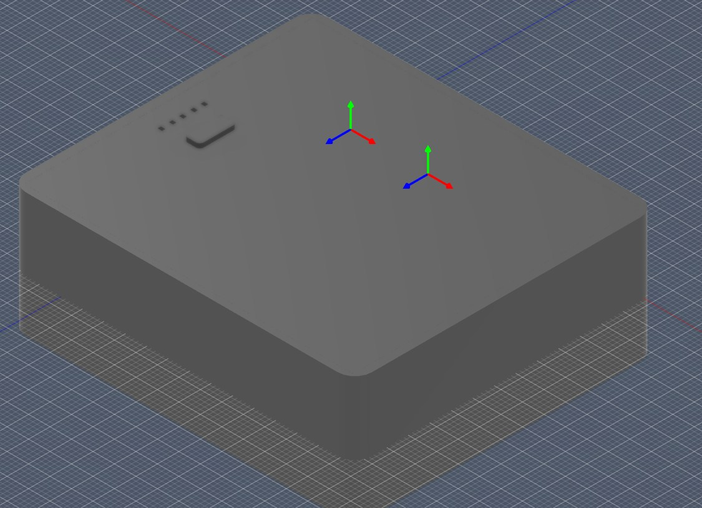
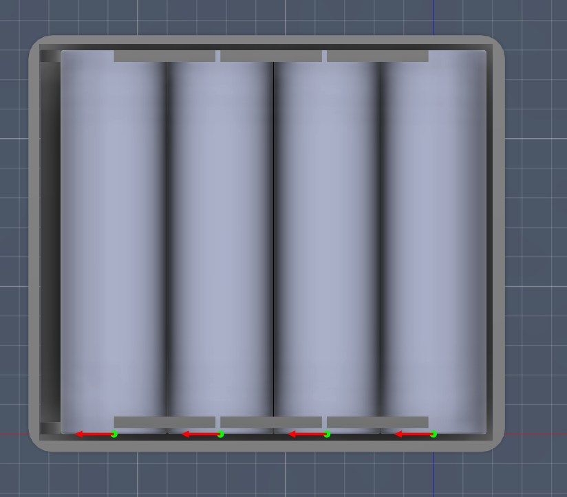
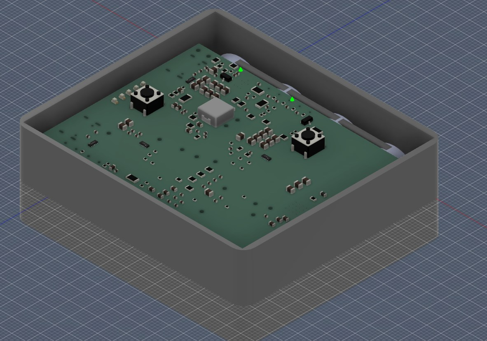
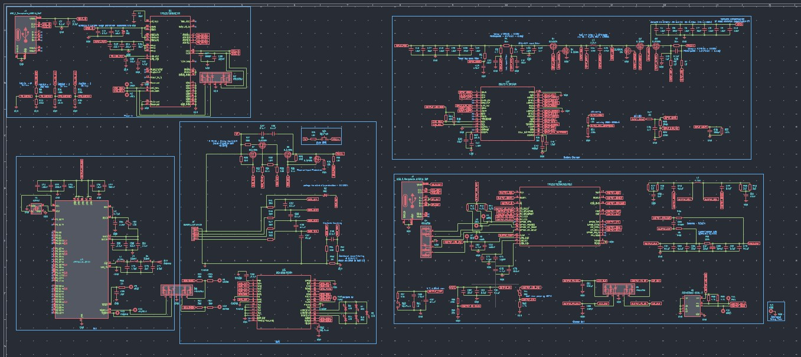

# FindMyCharger

A smart powerbank with locating capabilities through Apple FindMy network

- Low power at 10mA BLE transmission at +8dBm
- Charging input/output up to 60W
- 5 LED battery indicator

## Why did I make this?

There were 2 consecutive bicycle robbery that happened near where I live which got me curious, where do they place them at? With this, no SIM card nor GPS needed (which saves energy and mobile credits)!

## Firmware

I'm using [Macless Haystack](https://github.com/dchristl/macless-haystack), a framework for custom FindMy network without having to own a mac

Macless Haystack is included in this repository as a submodule under [firmware/macless-haystack](./firmware/macless-haystack/)

## Screenshots

### Casing

*18650 battery model from https://grabcad.com/library/cell-18650-1

### Schematics

### PCB

## I want one!!

You'll need to:
1. Order the PCB (or get PCBA assembly), please check [docs/calculations.md](./docs/calculations.md) for components requirements and [pcb/gerber_to_order](./pcb/gerber_to_order/) for gerber
2. Print bottom, button, and upper which can be found at [cad](./cad)
3. Get additional components/parts, list [here](#additional-components) and solder them
4. Place components and glue casing

## Addiitonal components

- 2x Tactile Button 6mm
- 4x Li-on 18650 battery
- Nickel strip (for better conductivity)

## Todo

- Include battery level transmission
- Smaller footprint
- Ultra Wide Band (UWB) for precise finding
- Support PD2.0 / PD3.1 / PPS, QC2/3/4/5, FCP / SCP / SFCP, AFC, MTK PE, Apple / BC1.2, UFCS (new universal Chinese standard)
- Support multiple controls (press, press & hold) on button
- Integrate both Macless Haystack and [Google FindMy](https://github.com/leonboe1/GoogleFindMyTools)) into one
