# FindMyCharger

<p align="center">
	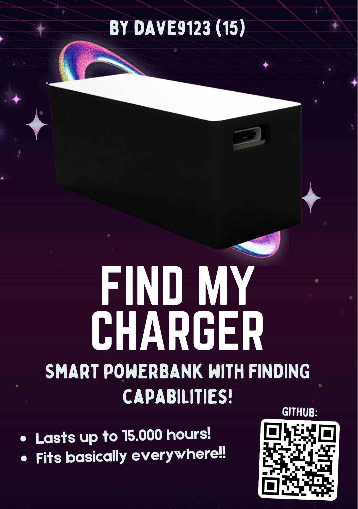
	<br><a href="./zine.pdf">View Magazine</a> - <a href="./BOM.pdf">View BOM</a>
</p>

FindMyCharger is a smart powerbank with finding capabilities so you don't have to worry where did you place your powerbank!

## Why?

I've been forgetting things a lot, also it can be part of aging (or ekhem ekhem sleep depreviation) which then causes people to lose their stuff. I don't hope for it, but there might be a chance that someone would steal your bag, and this just gives you a piece of mind!

## How it Works

IP5353 handles powerbank-like controls for charging and charging other devices, E104-BT5005A (based on nRF52805) transmits BLE packets which can be used with [Apple's FindMy](https://github.com/dchristl/macless-haystack) and/or [Google's Find Hub](https://github.com/leonboe1/GoogleFindMyTools).

## Build Instructions

You can either:
- PCBA
- Manual Solder 


Afterwards, you'll need:

1. Everything from [BOM](./BOM.md) (pick PCBA/detailed depending on your usecase)
2. SWD Debugging Interface
3. 4x Jumper Wires

(additional if manual solder)
4. Soldering Iron
5. Solder


Steps:
1. Print the PCB from [pcb/jlcpcb/production_files/GERBER-FindMyCharger.zip](./pcb/jlcpcb/production_files/GERBER-FindMyCharger.zip)
2. Solder the components based on [BOM](#BOM) or PCBA with [JLCPCB CPL](./pcb/jlcpcb/production_files/CPL-FindMyCharger.csv) and [JLCPCB BOM](./pcb/jlcpcb/production_files/BOM-FindMyCharger.csv)
3. 3D print the casing in [CAD folder](./cad/components/)
4. Place the battery on the bottom holder

| 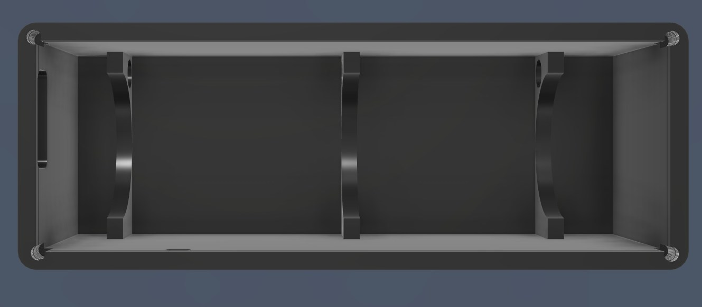 | 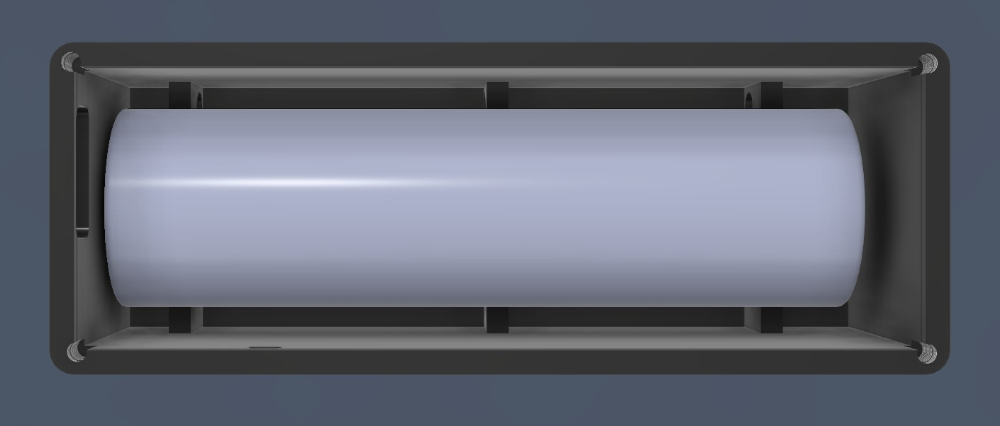 |
| :------------------------------------------: | :---------------------------------------------------------------: |

5. Solder battery with wires (to be soldered on the PCB)
6. Place the bottom holder dock

|  | 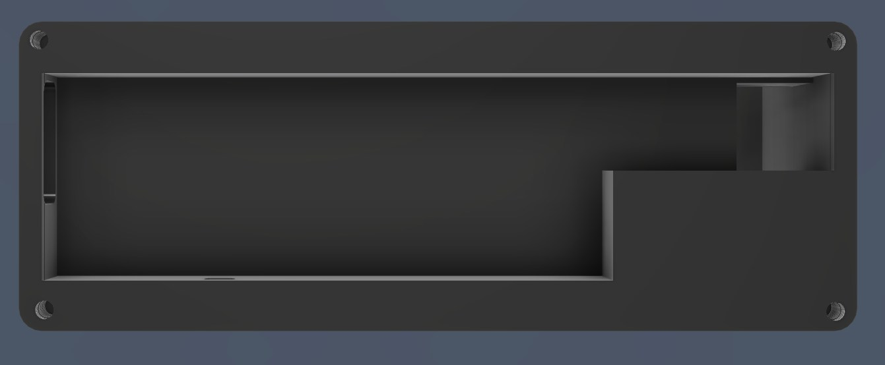 |
| :---------------------------------------------------------------: | :---------------------------------------------------------------------: |

7. Place and fit the PCB on the dock

|  | 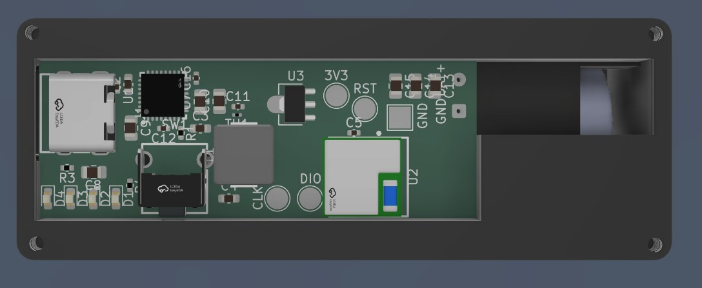 |
| :---------------------------------------------------------------------: | :----------------------------------------------------------: |

8. Build and flash the [firmware](#firmware)
9. Place the top and screw it with M2x6

|  | 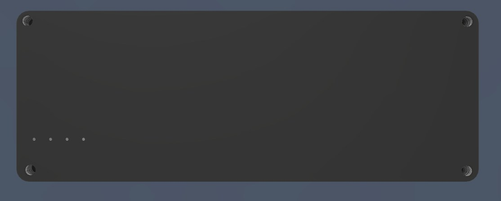 |
| ------------------------------------------------------------ | --------------------------------------------------------- |

## Firmware

The firmware for FindMyCharger is using [Macless Haystack](https://github.com/dchristl/macless-haystack), a framework for custom FindMy network without having to own a Mac.

Macless Haystack is included in this repository as a submodule under [firmware/macless-haystack](../firmware/macless-haystack/)


### Prerequisites (guide below to install):

1. nRF Connect SDK
2. https://github.com/dchristl/macless-haystack repo or current (follow guide below)
3. Python 2/3 (with pip), download [here](https://www.python.org/downloads/)
4. Pip package ["cryptography"](http://pypi.org/project/cryptography) -- `pip install cryptography`
5. Visual Studio Code, download [here](https://code.visualstudio.com/)
6. CMake, download [here](https://cmake.org/download/) or `sudo apt install cmake`

 ### Clone repository along with submodules:

7. Install the ["nRF Connect for VS Code" VSCode Extension here](https://marketplace.visualstudio.com/items?itemName=nordic-semiconductor.nrf-connect)

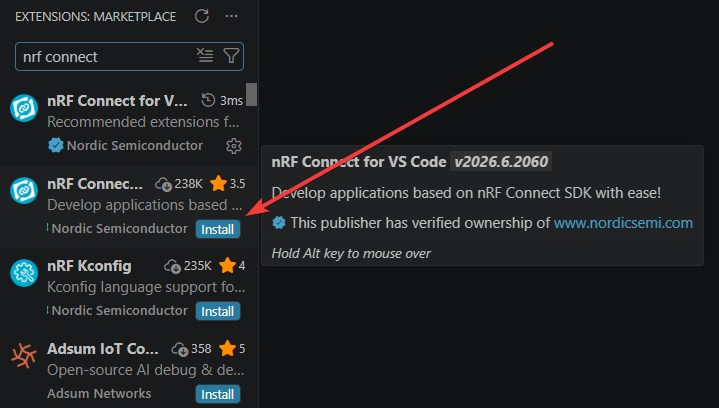

2. Open the nRF Connect extension on the left bar

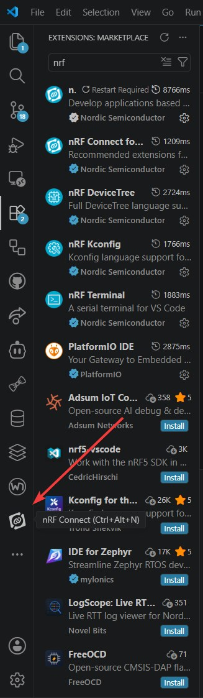

3. Click on "Install SDK" and pick the latest version
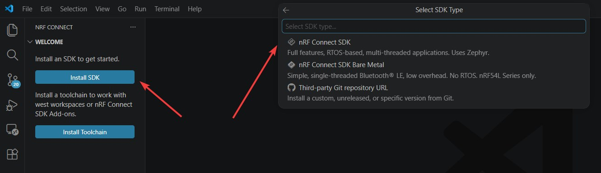

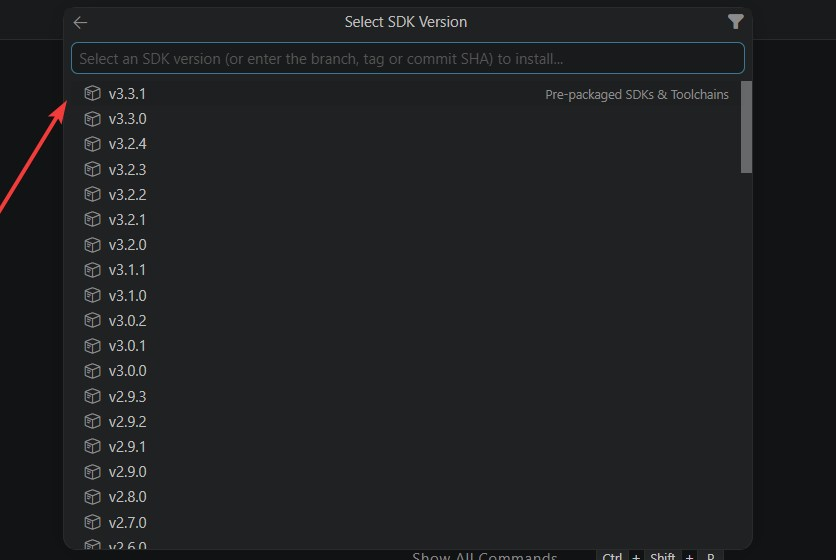
4. Click on "Install Toolchain" and pick the latest version

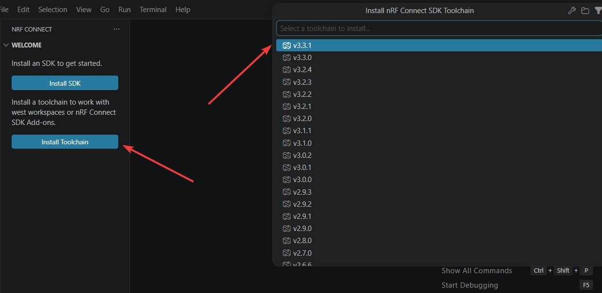

5. Wait for it to finish installing

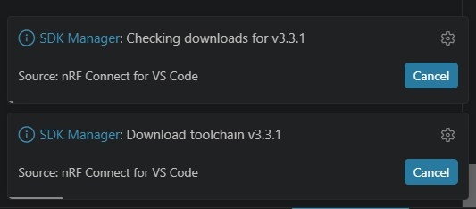

### Clone repository along with submodules

```
git clone --recurse-submodules https://github.com/dave9123/FindMyCharger

cd FindMyCharger/firmware/macless-haystack

git -C macless-haystack submodule update --init --remote --recursive
```

Then, you'll need to download the firmware (nrf52_firmware.bin) at Macless Haystack releases [here](https://github.com/dchristl/macless-haystack/releases) or build your own:
```
cd firmware/macless-haystack

py generate_keys.py # Note the output folder from the output "Output will be written to {OUTPUT_FOLDER}"

cd firmware/nrf5x

NRF_MODEL=nrf52 BOARD=BOARD_E104BT5032A make build

make patch
```

### Afterwards, update the finding public key

note: use Git Bash on Windows
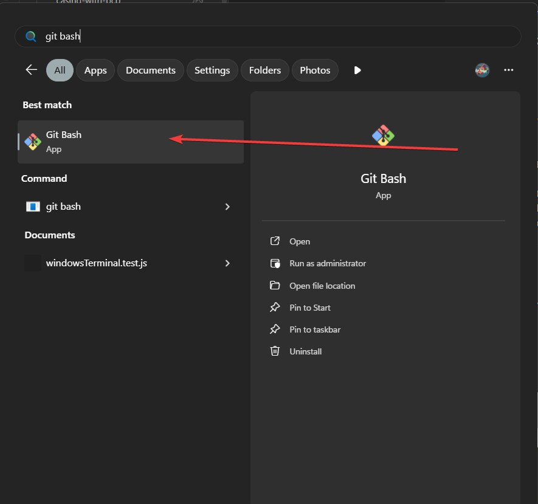

Replace "PREFIX_keyfile" with the path to your generated public key (stored in the ../../output folder)

```
export LC_CTYPE=C

xxd -p -c 100000 PREFIX_keyfile | xxd -r -p | dd of=nrf52_firmware.bin skip=1 bs=1 seek=$(grep -oba OFFLINEFINDINGPUBLICKEYHERE! nrf52_firmware.bin | cut -d ':' -f 1) conv=notrunc
```

### Patch and deploy firmware

```
openocd -f interface/stlink.cfg -c "transport select hla_swd" -f target/nrf52.cfg -c "init; halt; nrf5 mass_erase; program nrf52_firmware.bin verify; reset run; exit"
```


The complete guide on setting Macless Haystack can be found [here](https://github.com/dchristl/macless-haystackhttps://github.com/dchristl/macless-haystack)!

## Casing

|  | 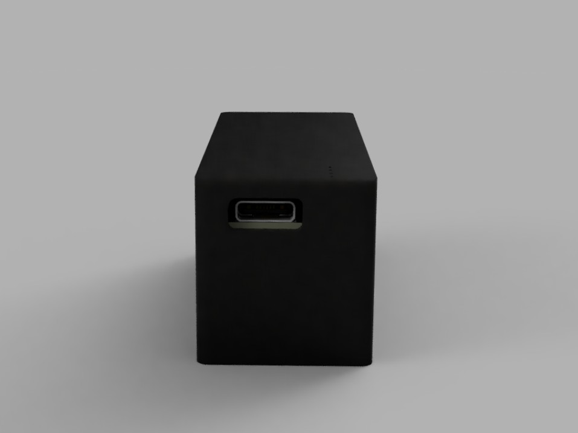 |
| :------------------------------------: | :--------------------------------------: |

I'm honestly really proud of how it ends up, especially the sliding mechanism which makes everything easier to place


| 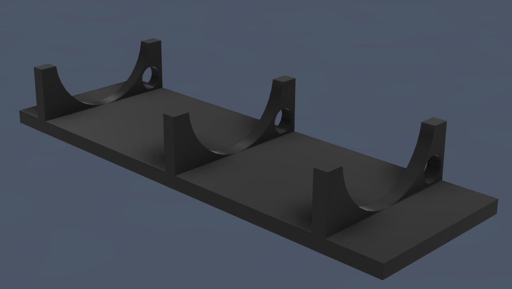 | 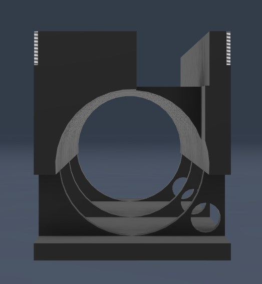 |
| :-----------------------------------------------------------------: | :------------------------------------------------------: |

The holes on the side is for the cable to passthrough either the GND or positive side of the battery to be soldered onto the PCB

## Schematics

Detailed components list used can be found in the [BOM section](#bom)

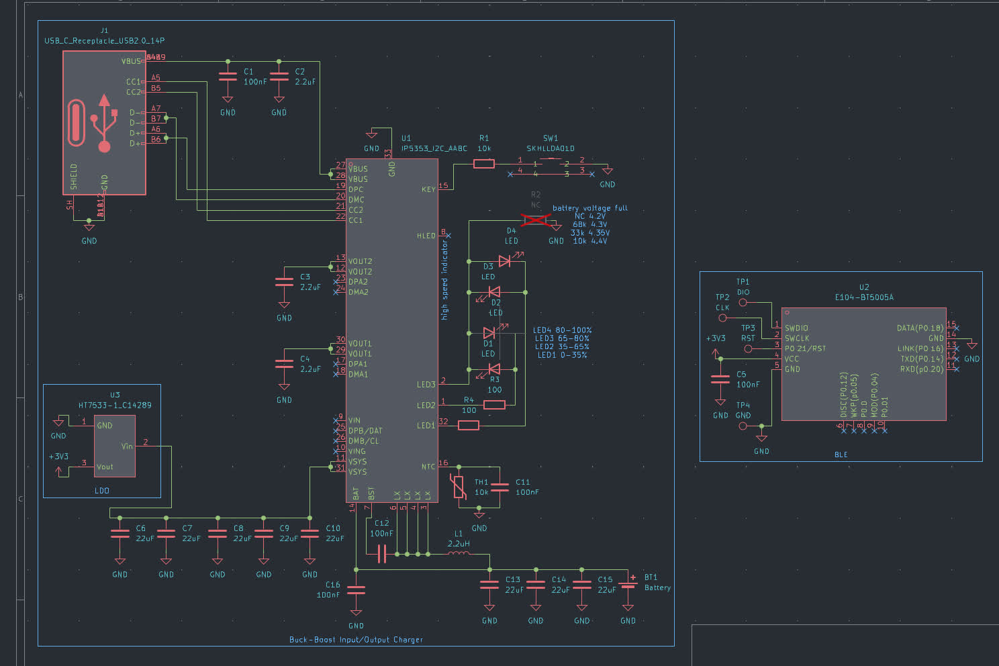
[View PDF](./assets/schematics.pdf)

## PCB

|                    Design                     |                 Rendered                 |
| :-------------------------------------------: | :--------------------------------------: |
| 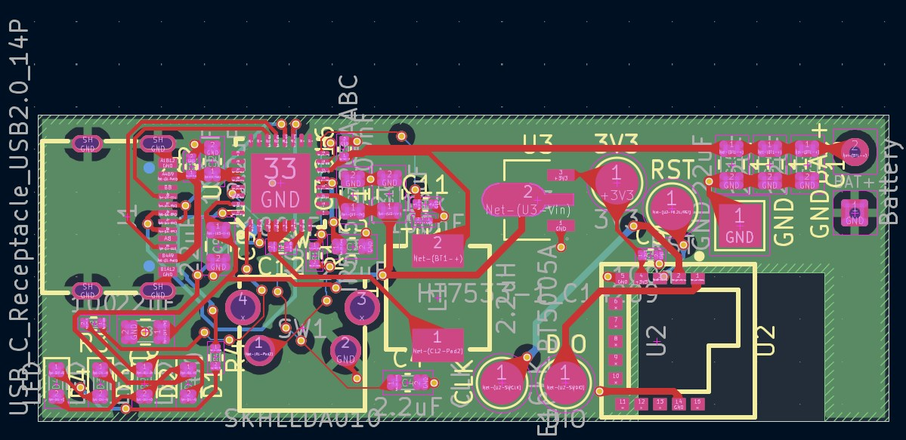 | 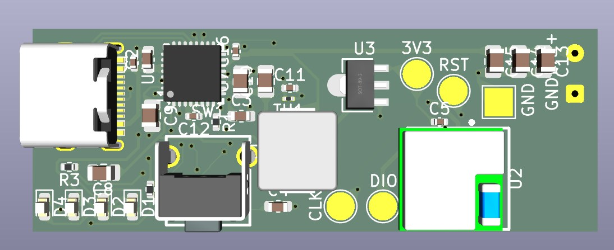 |

[View PDF](./assets/pcb.pdf)

Footprints used:
1. Battery Solder Pad - `Connector_Wire:SolderWire-0.1sqmm_1x02_P3.6mm_D0.4mm_OD1mm`
2. Capacitor 100nF - `Capacitor_SMD:C_0402_1005Metric`
3. Capacitor 2.2uF - `Capacitor_SMD:C_0603_1608Metric`
4. Capacitor 22uF - `Capacitor_SMD:C_0805_2012Metric`
5. LED `LED_SMD:LED_0603_1608Metric`
6. USB C Receptacle - `footprints:USB-C-SMD_TYPE-C16PIN` (imported from EasyEDA, included under `pcb/libraries/footprints.pretty)
7. Inductor 2.2uH - `footprints:IND-SMD_L6.0-W6.0_CHILISIN_HPPC06030` (imported from EasyEDA, included under `pcb/libraries/footprints.pretty`)
8. Resistor 10kΩ - `Resistor_SMD:R_0402_1005Metric`
9. Resistor 100Ω - `Resistor_SMD:R_0402_1005Metric`
10. 90deg Tactile Button - `footprints:KEY-TH_SKHLLDA010` (imported from EasyEDA, included under `pcb/libraries/footprints.pretty`)
11. Test Points - `TestPoint:TestPoint_Pad_D2.5mm`
12. IP5353 (charging) - `footprints:QFN-32_L5.0-W5.0-P0.50-TL-EP3.5` (imported from EasyEDA, included under `pcb/libraries/footprints.pretty`)
13. E104-BT5005A (BLE) - `footprints:BULETM-SMD_E104-BT5005A` (imported from EasyEDA, included under `pcb/libraries/footprints.pretty`)
14. 3.3V Voltage Regulator - `footprints:SOT-89-3_L4.5-W2.5-P1.50-LS4.2-BR` (imported from EasyEDA, included under `pcb/libraries/footprints.pretty`)

## BOM

### PCBA

| Item                | Quantity | Total Cost         | Order                                                                                                                                             |
| ------------------- | -------- | ------------------ | ------------------------------------------------------------------------------------------------------------------------------------------------- |
| M2x6 Screw          | 4        | Rp5.000<br>~$0.28  | https://www.tokopedia.com/archive-lapaktukang/10pcs-baut-hitam-m2-m2x3-m2x4-m2x5-m2x6-m2x7-m2x8-m2x10-1731486102402008940                         |
| 18650 Li-on Battery | 1        | Rp27.500<br>~$1.54 | https://www.tokopedia.com/nayfastore/baterai-isi-ulang-baterai-tipe-lithium-ion-18650-butontop-3000mah-3-7v-isi-2-pcs-1731453786169640483         |
| Casing 3D Print     | 1        | Rp44.384<br>~$2.49 |                                                                                                                          |
| PCBA                | 1        | $45.63             |                                                                                                                             |
| Wire                | 2        | Rp4.000<br>~$0.22  | https://www.tokopedia.com/cncstorebandung/kabel-tunggal-mini-wire-single-core-tinned-cu-permeter-hitam-merah-hijau-kuning-putih-0-6mm-hitam-27149 |
|                     |          |                    |                                                                                                                                                   |
| Total               |          | $48.4              |                                                                                                                                                   |

### Detailed

| Item                            | Quantity | Total Cost         | Order                                                                                                                                             |
| ------------------------------- | -------- | ------------------ | ------------------------------------------------------------------------------------------------------------------------------------------------- |
| M2x6 Screw                      | 4        | Rp5.000<br>~$0.28  | https://www.tokopedia.com/archive-lapaktukang/10pcs-baut-hitam-m2-m2x3-m2x4-m2x5-m2x6-m2x7-m2x8-m2x10-1731486102402008940                         |
| 18650 Li-on Battery             | 1        | Rp27.500<br>~$1.54 | https://www.tokopedia.com/nayfastore/baterai-isi-ulang-baterai-tipe-lithium-ion-18650-butontop-3000mah-3-7v-isi-2-pcs-1731453786169640483         |
| Casing 3D Print                 | 1        | Rp44.384<br>~$2.49 |                                                                                                                          |
| Wire                            | 2        | Rp4.000<br>~$0.22  | https://www.tokopedia.com/cncstorebandung/kabel-tunggal-mini-wire-single-core-tinned-cu-permeter-hitam-merah-hijau-kuning-putih-0-6mm-hitam-27149 |
| Resistor 100Ω 0402              | 2        | $0.002             | C25076 (JLCPCB)                                                                                                                                   |
| Capacitor 100nF 0402            | 5        | $0.04              | C307331 (JLCPCB)                                                                                                                                  |
| Resistor 10k 0402               | 1        | $0.015             | C25744 (JLCPCB)                                                                                                                                   |
| Thermistor 10k 3380K 0402       | 1        | $0.008             | C29553871 (JLCPCB)                                                                                                                                |
| Capacitor 2.2uF 0603            | 3        | $0.027             | C23630 (JLCPCB)                                                                                                                                   |
| Inductor 2.2uH SMD 6.0x6.0mm    | 1        | $0.24              | C285900 (JLCPCB)                                                                                                                                  |
| USB C Receptacle 16P            | 1        | $0.065             | C393939 (JLCPCB)                                                                                                                                  |
| Capacitor 22uF 0805             | 7        | $0.665             | C45783 (JLCPCB)                                                                                                                                   |
| LED White 0603                  | 4        | $0.048             | C2290 (JLCPCB)                                                                                                                                    |
| 90deg Tactile Button SKHLLDA010 | 1        | $0.239             | C125032 (JLCPCB)                                                                                                                                  |
| Bluetooth Module E104-BT5005A   | 1        | $3.67              | C2874127 (JLCPCB)                                                                                                                                 |
| 3.3V LDO HT7533                 | 1        | $0.125             | C14289 (JLCPCB)                                                                                                                                   |
| Charging Module IP5353          | 1        | $0.999             | C46550234 (JLCPCB)                                                                                                                                |
| 4-layer PCB                     | 1        | $2.1               | JLCPCB                                                                                                                                            |
|                                 |          |                    |                                                                                                                                                   |
| Total                           |          | $12.55             |                                                                                                                                                   |
note: JLCPCB components are for PCBA only and total cost doesn't factor extended ($3) cost nor PCBA fees

note 2: price does not include shipping, taxes, customs (import) nor Minimum Order Quantity (MOQ)

*price as of 27/06/2026 03:22 GMT+7*

## Credits

Software used:
- [KiCad](https://kicad.org/)
- [Autodesk Fusion](https://www.autodesk.com/education/edu-software/fusion)

- 18650 Battery 3D model: https://grabcad.com/library/cell-18650-1
- Macless Haystack: https://github.com/dchristl/macless-haystack