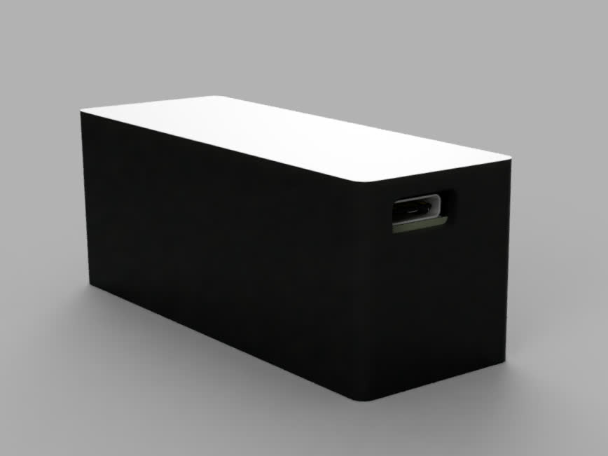
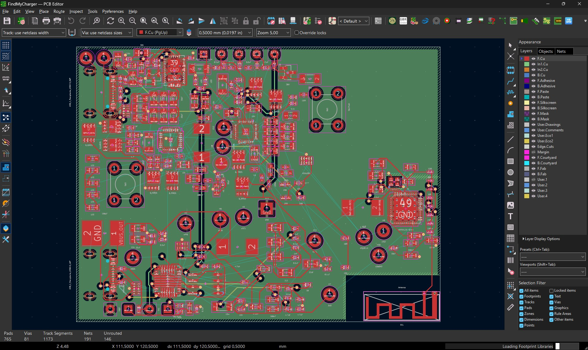

# FindMyCharger


[View Magazine](./zine.pdf) - [View BOM](./BOM.md)

FindMyCharger is a smart powerbank with finding capabilities so you don't have to worry where did you place your powerbank!


## Why?

Forgetting can be part of aging (or ekhem ekhem sleep depreviation) which then causes people to lose their stuff. Also, there might be a chance that someone would steal your bag.


## How it Works

IP5353 handles powerbank-like controls for charging and charging other devices, E104-BT5005A (based on nRF52805) transmits BLE packets which can be used with [Apple's FindMy](https://github.com/dchristl/macless-haystack) and/or [Google's Find Hub](https://github.com/leonboe1/GoogleFindMyTools).


## Build Instructions

You can either:
- PCBA
- Manual Solder 


Afterwards, you'll need:

1. Everything from [BOM](./BOM.md) (pick PCBA/detailed depending on your usecase)
2. SWD Debugging Interface
3. 4x Jumper Wires

(additional if manual solder)
4. Soldering Iron
5. Solder


Steps:
1. Print the PCB from [pcb/jlcpcb/production_files/GERBER-FindMyCharger.zip](./pcb/jlcpcb/production_files/GERBER-FindMyCharger.zip)
2. Solder the components based on [BOM](./BOM.md) or PCBA with [JLCPCB CPL](./pcb/jlcpcb/production_files/CPL-FindMyCharger.csv) and [JLCPCB BOM](./pcb/jlcpcb/production_files/BOM-FindMyCharger.csv)
3. 3D print the casing in [CAD folder](./cad/components/)
4. Put everything together
5. Solder battery with wire to BT1 with wires
6. Build and flash the [firmware](#firmware)
7. Screw everything together, and that's it!


## Firmware

The firmware for FindMyCharger is using [Macless Haystack](https://github.com/dchristl/macless-haystack), a framework for custom FindMy network without having to own a Mac.

Macless Haystack is included in this repository as a submodule under [firmware/macless-haystack](../firmware/macless-haystack/)

You'll need to clone this repository with submodules:

```
git clone --recurse-submodules https://github.com/dave9123/FindMyCharger
```

The guide on setting Macless Haystack can be found [here](./firmware/macless-haystack/firmware/nrf5x)!

## Casing



## Schematics


[View PDF](./assets/schematics.pdf)


## PCB



[View PDF](./assets/pcb.pdf)


## Credits

Software used:
- [KiCad](https://kicad.org/)
- [Autodesk Fusion](https://www.autodesk.com/education/edu-software/fusion)

- 18650 Battery 3D model: https://grabcad.com/library/cell-18650-1
- Macless Haystack: https://github.com/dchristl/macless-haystack